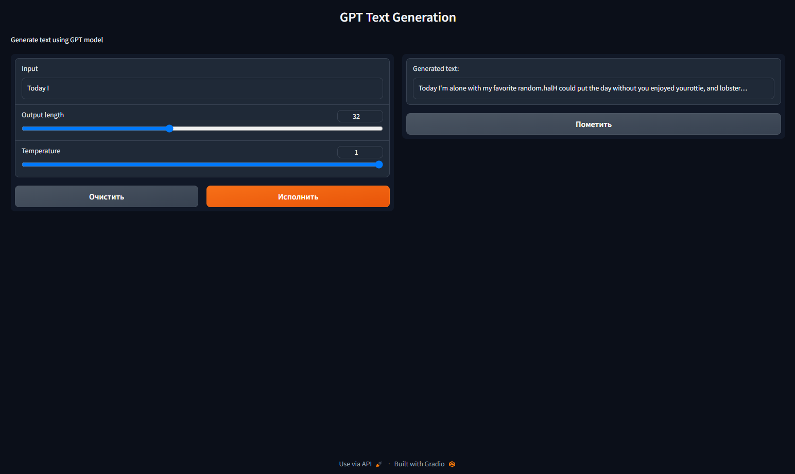

# Generative Pre-trained Transformer (GPT)
This is an implementation of the GPT (Generative Pre-trained Transformer) model in PyTorch.


<p align="center">

</p>

## Training
The model was trained for 5 epochs. 

### Trained model configuration:
```python
model = GPT(
    vocab_size=len(tokenizer), # (50261 tokens)
    n_layers = 8,
    n_heads = 8,
    d_model = 512,
    resid_dropout = 0.1,
    attn_dropout = 0.1,
    d_ff = 2048,
    ff_dropout = 0.1,
    embed_dropout = 0.1,
    max_len = 64,
    pad_idx = tokenizer.encode(tokenizer.pad_token)[0]
)
```
Parameters count of model with this configuation: 51.035.733.

### Tokenization:
Text was tokenized using the [GPT2Tokenizer ](https://huggingface.co/docs/transformers/model_doc/gpt2#transformers.GPT2Tokenizer) from the [HuggingFace transformers](https://huggingface.co/docs/transformers/index) library.

### Dataset:
Dataset on which the model was trained is [tweet_eval](https://huggingface.co/datasets/tweet_eval) dataset.
To prepare this just run [data_loader.py](data_loader.py) script.   
Dataset was loaded using the [huggingface datasets](https://huggingface.co/docs/datasets/index) library.       

## Project Structure
The project structure is as follows:
* [data_loader.py](data_loader.py) - prepares the dataset
* [gpt.py](gpt.py) - defines the model
* [trainer.py](trainer.py) - trains and predicts the model
* [gradio_ui.py](gradio_ui.py) - renders the UI

## Examples:
*I love that your dreams #l Blackf next time @ Los Angeles, California*     
*I can'toon Area is as good as I' bad with you @ Disney California Adventure*       
*You can onlyall be in love? You're Six Flags!force has a hyparade Monica with a good kind of morning …*        
*Dogs're back ️ @ The Wizarding World of Harry Potter at Universal Studios Hollywood*        
*We are so cool! #20of•• #art # Village but happy #Family @ the own goals goals LA*       

## Gradio UI
<p align="center">

</p>


